# Système de gestion des transports des biens et des personnes

### ***PAGE D'ACCEUIL:** *

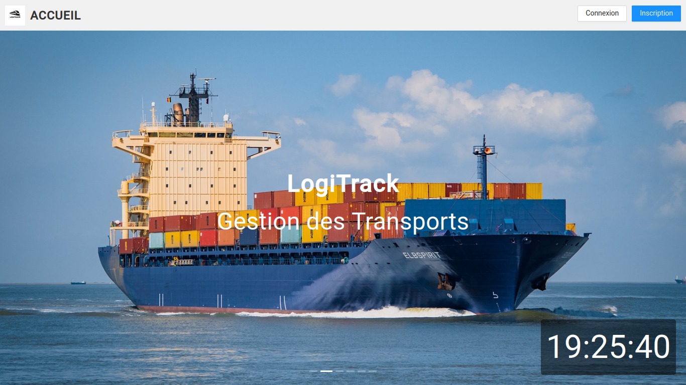

Cette page comporte boux boutons : 

* le bouton d'inscription
* le bouton pour la connexion.

## Page de connexion:

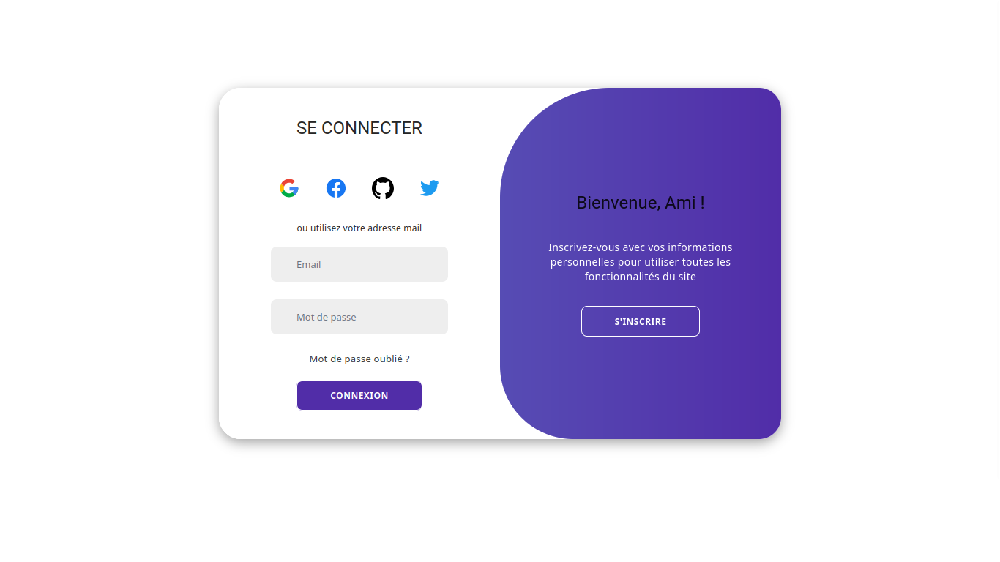

## Page d'inscription:

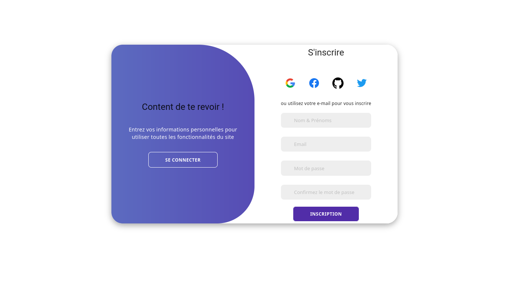

On a également la possibilité de se connecté avec des services tiers tels que : **Google, facebook, github et twitter.**

Après l'authentification, on est redirigé vers le dashbord en fonction du rôle de l'utilisateur.

#### * Si le rôle de celui qui s'est connecté est un "**admin**"

## Dashbord
Sur le dashbord, l'administrateurs à un récapitulatif de tous ces actions.
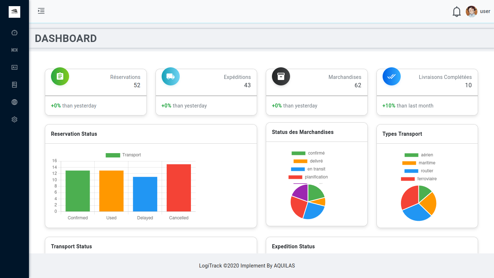

## Véhicule

IL pourra voir ou ajouter des véhicules de transport , les modifier, ou encore les supprimer.

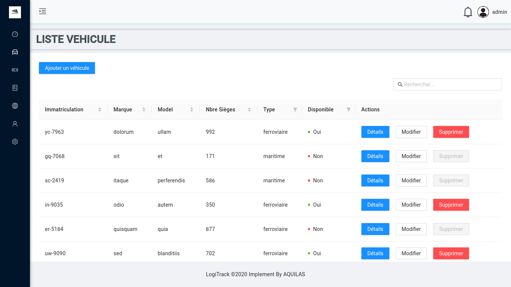
## Transport

L'administrateur peut visualiser, ajouter, modifier, ou supprimer les transports.
NB: I ne pourra pas supprimer ou modifier un transport en cours.

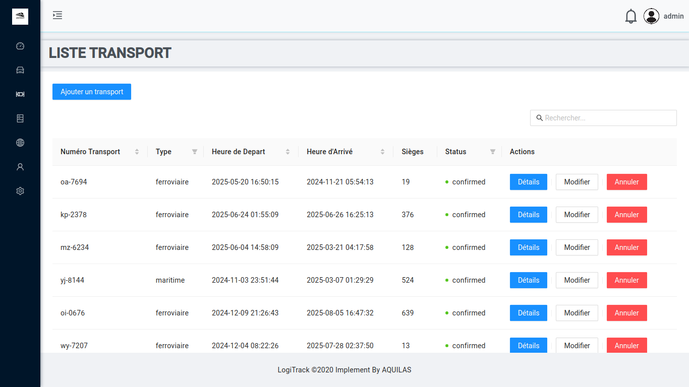

## Marchandise

A ce niveau, l'admin pourra voir tous les marchandises que les utilisateurs ont enrégistré dans le système, et choisir de les associées à une expédition.

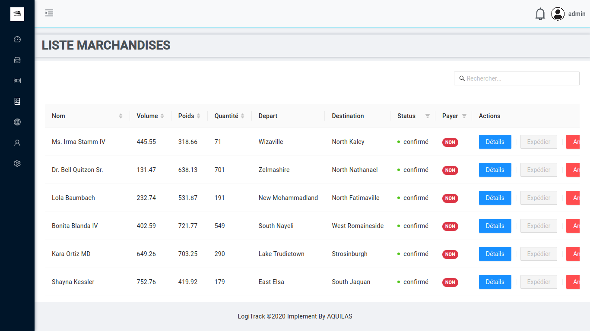

## Expedition
L'administrateur aura la liste de tous les expeditions ainsi que leur status.
POur chaque expédition de marchandises enregistrées, il aura à l'associer à des marchandises.

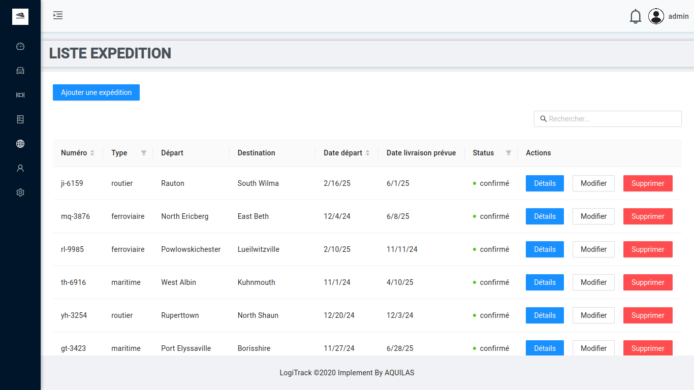
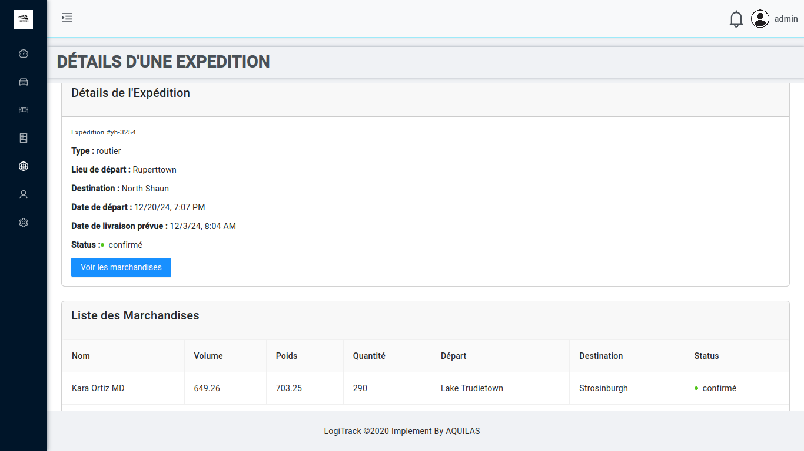

#### * Si le rôle de celui qui s'est connecté est un "**user**":

## Dashbord
Sur le dashbord, l'utilisateur à un récapitulatif de tous ces actions.

## Transport

### Visualiser les transports en cours :
L'utilisateur peut visualiser plusieurs transports initier par l'administrateur et choisir de réserver une place.

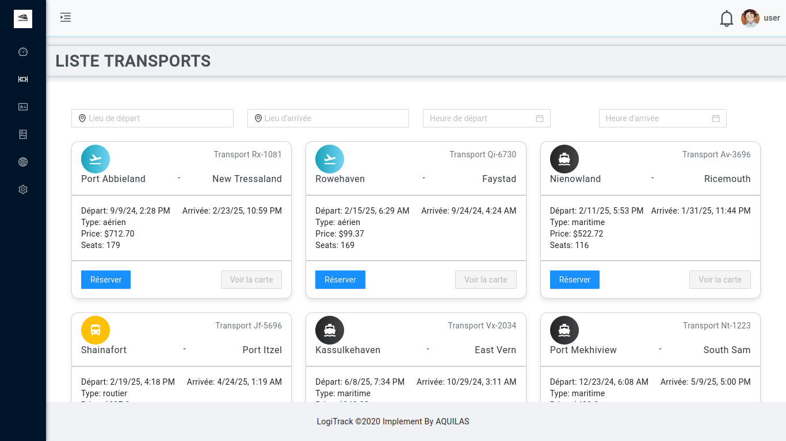

### Historique des transports :
C'est l'historique des transports auquels un utilisateurs aura pris part.

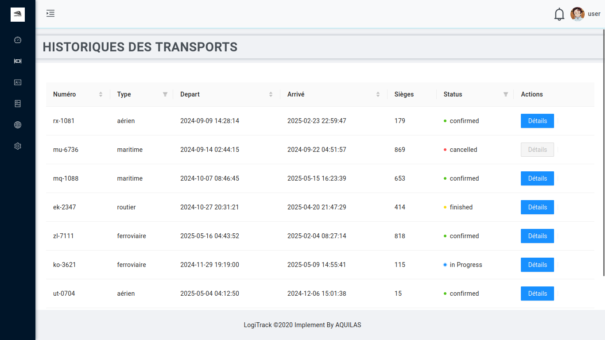

## Reservation

### Faire une réservation: 

Les champs de transports, de départ et de destination sont remplis automatiquement en fonction du transport que l'utilisateur choisira.

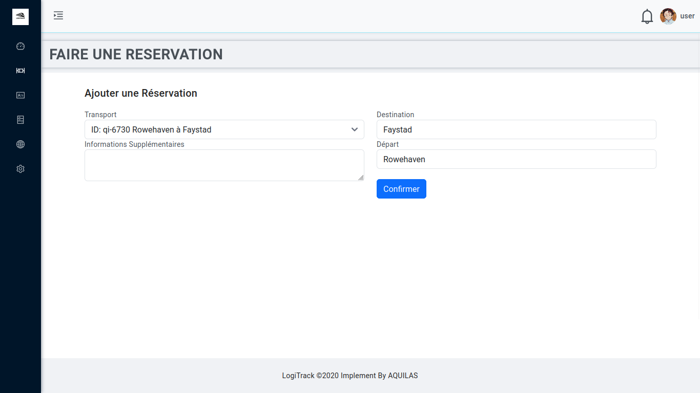

### Liste des réservations d'un utilisateur:

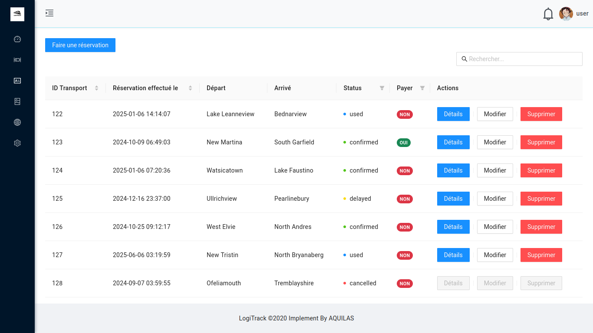

## Marchandise

### Liste des marchandises:

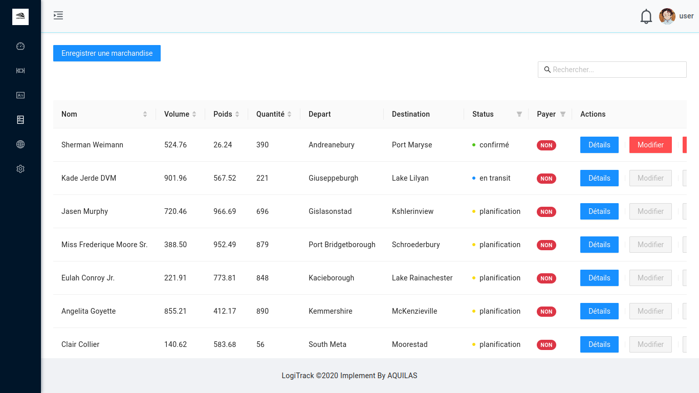

### Enregistrer une marchandise :

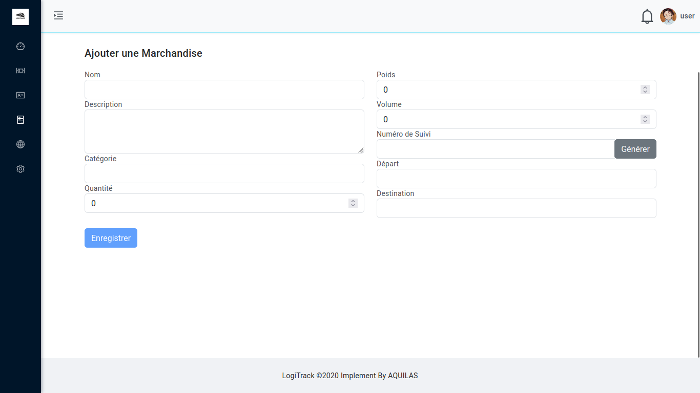

## Expedition

### Historique des expéditions :

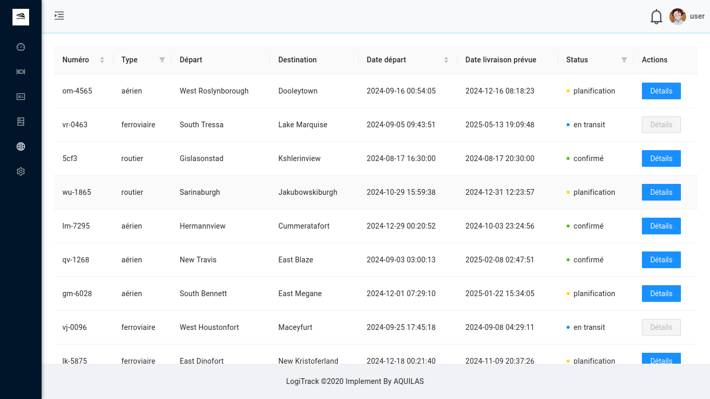

## Profil de l'utilisateur

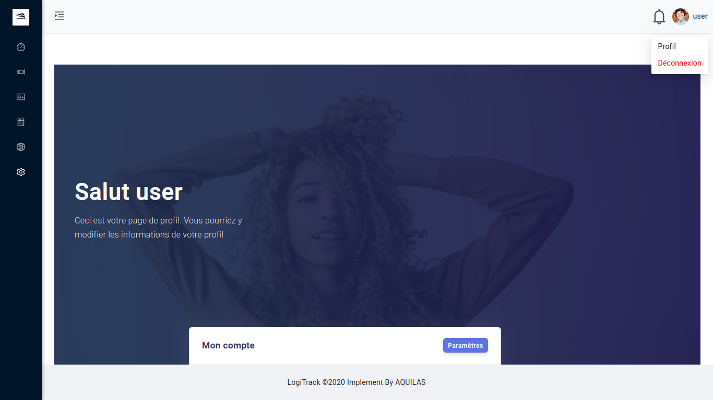

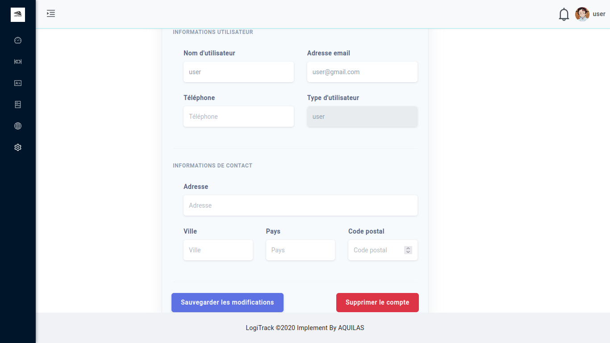

En cliquant sur l'icône de notifications en haut, l'utilisateur pourra consulter ses notifications.
